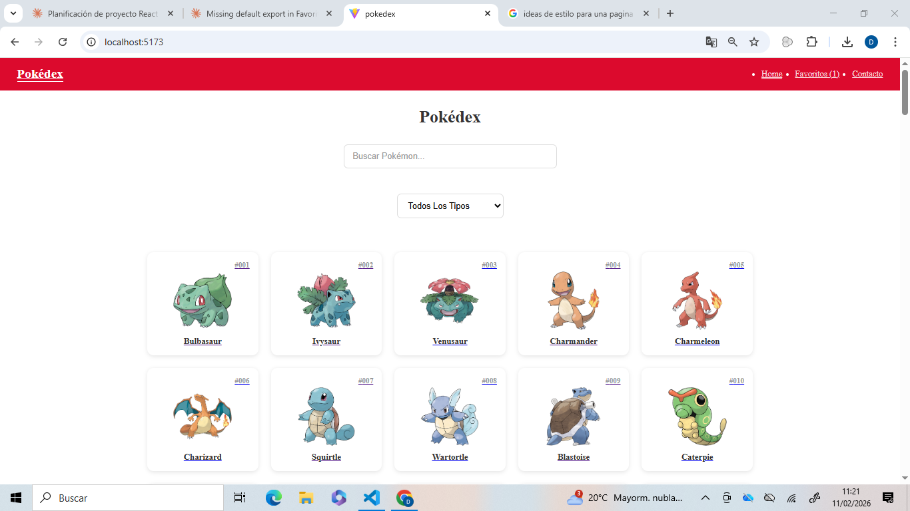
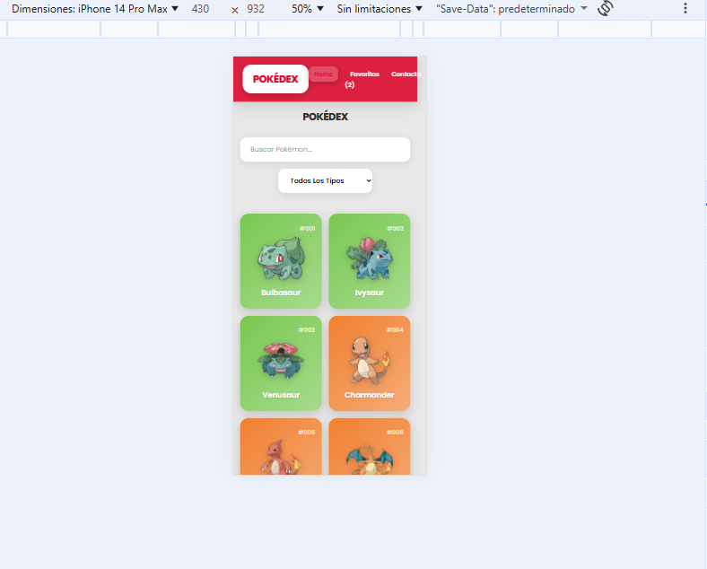

# 🔴 Pokédex React

Aplicación web que consume la [PokéAPI](https://pokeapi.co/) para explorar los 151 Pokémon originales. Desarrollada como proyecto de libre elección durante el bootcamp fullstack de The Rock Code.

## 📸 Capturas

### Desktop


### Móvil


## 🚀 Demo

Proyecto en desarrollo local. Instrucciones de instalación abajo.

## 🛠️ Stack tecnológico

- **React 18 + Vite** — Base del proyecto
- **React Router DOM** — Navegación entre páginas
- **React Hook Form** — Formulario de contacto con validaciones
- **CSS puro** — Estilos sin librerías externas
- **PokéAPI** — Fuente de datos de los Pokémon

## ✨ Funcionalidades

- ✅ Listado de los 151 Pokémon originales
- ✅ Búsqueda por nombre en tiempo real
- ✅ Filtro por tipo de Pokémon
- ✅ Página de detalle con estadísticas base
- ✅ Sistema de favoritos con persistencia en `localStorage`
- ✅ Formulario de contacto con validaciones (React Hook Form)
- ✅ Diseño responsive — móvil, tablet y desktop
- ✅ Optimización de rendimiento con `React.memo`

## 🧩 Decisiones técnicas

### Hook personalizado `useFetch`
Creé un hook propio para centralizar todas las llamadas a la PokéAPI, evitando duplicar lógica de `useEffect`, estados de carga y manejo de errores en cada componente.

```js
const { data, loading, error } = useFetch(url);
```

### Context API para favoritos
El sistema de favoritos usa `FavoritesContext` para compartir estado global sin librerías externas. Los favoritos se persisten en `localStorage` para sobrevivir recargas de página.

### `React.memo` para optimización
Los componentes de tarjeta de Pokémon están envueltos en `React.memo` para evitar re-renders innecesarios al filtrar o buscar.

## 📁 Estructura del proyecto

```
src/
├── components/    # Componentes reutilizables (PokemonCard, Navbar...)
├── pages/         # Home, Detail, Favorites, Contact
├── hooks/         # useFetch (hook personalizado)
├── context/       # FavoritesContext + FavoritesProvider
├── services/      # Llamadas a la PokéAPI
└── utils/         # Funciones auxiliares
```

## ⚙️ Instalación local

```bash
# Clona el repositorio
git clone https://github.com/isaac-davv/pokedex-react.git
cd pokedex-react

# Instala dependencias
npm install

# Arranca el servidor de desarrollo
npm run dev
```

La aplicación estará disponible en `http://localhost:5173`

## 👨‍💻 Autor

**Isaac Correa**
- GitHub: [isaac-davv](https://github.com/isaac-davv)